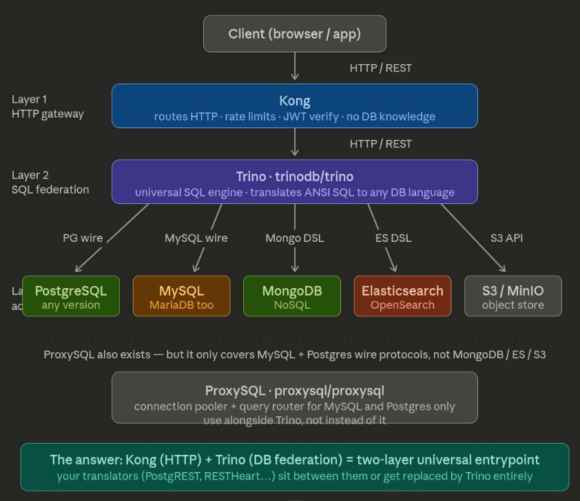
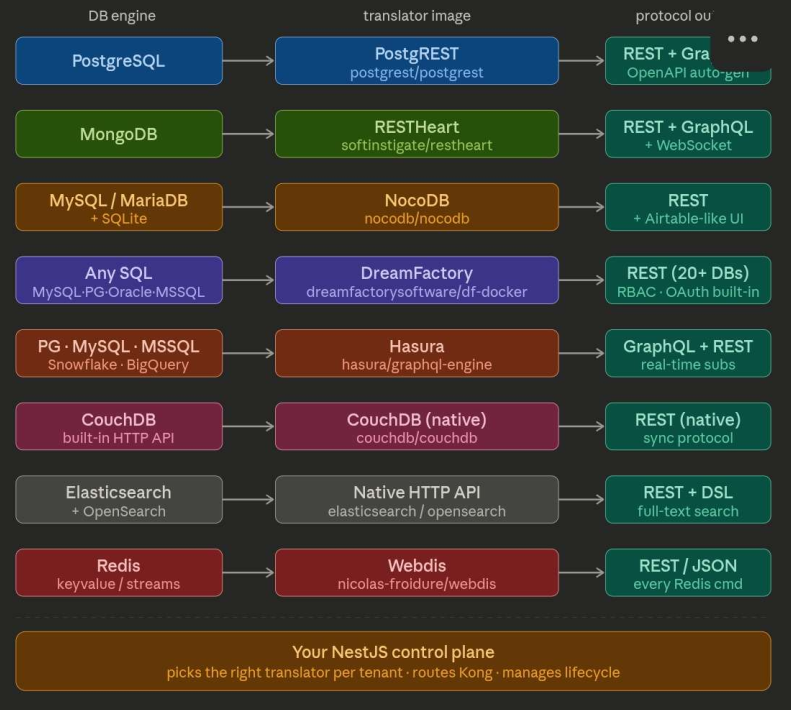
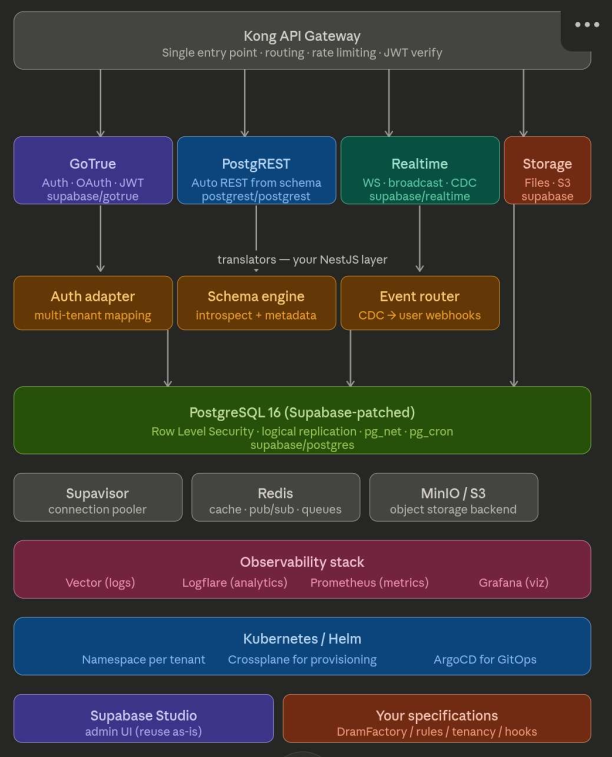
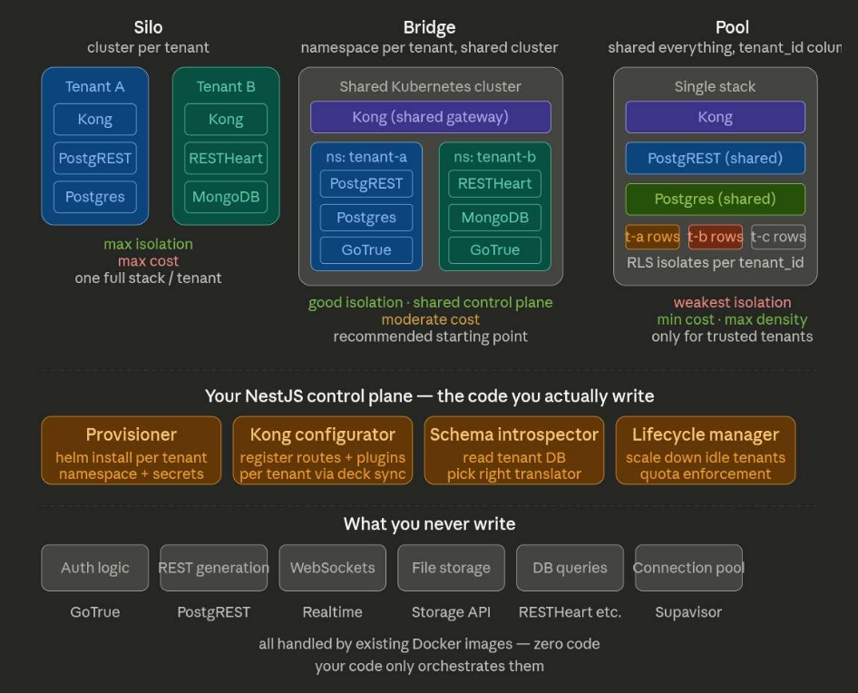

# Mini BaaS Infrastructure Documentation

## Table of Contents
1. [Architecture Overview](#architecture-overview)
2. [Layer 1: HTTP Gateway](#layer-1--http-gateway)
3. [Layer 2: SQL Federation](#layer-2--sql-federation)
4. [Authentication & Authorization](#authentication--authorization)
5. [API Layers & Translators](#api-layers--translators)
6. [Database Layer](#database-layer)
7. [Real-time & Messaging](#real-time--messaging)
8. [Storage & Caching](#storage--caching)
9. [Connection Management](#connection-management)
10. [Observability Stack](#observability-stack)
11. [Multi-Tenancy Models](#multi-tenancy-models)
12. [Deployment & Orchestration](#deployment--orchestration)

---

## Architecture Overview

The Mini BaaS infrastructure is built as a multi-layered, cloud-native platform designed to provide complete backend-as-a-service capabilities with support for multiple database engines and multi-tenancy patterns.

### Core Architecture Principles
- **Two-Layer Universal Entrypoint**: Kong (HTTP) + Trino (DB Federation)
- **Multi-Database Support**: PostgreSQL, MySQL, MongoDB, Elasticsearch, and more
- **Schema-Driven**: Every component is driven by tenant schemas and database metadata
- **Isolated Translators**: Each DB engine has its own PostgREST-like translator
- **Multi-Tenancy Ready**: Support for Silo, Bridge, and Pool isolation models

### System Diagram


---

## Layer 1: HTTP Gateway

### Kong API Gateway
- **Image**: [Kong API](https://hub.docker.com/_/kong) official docker image
- **Purpose**: Single entry point for all HTTP traffic, handles routing, rate limiting, JWT verification, and plugin ecosystem
- **Key Features**:
  - HTTP/REST routing with path-based and hostname-based routing
  - Rate limiting and quota management
  - JWT token verification
  - Plugin ecosystem for custom middleware
  - Load balancing and failover
  - Request/response transformation
- **Configuration**: 
  - Routes requests to appropriate backend services
  - Registers tenants via deck (declarative plugin sync)
  - No database knowledge at this layer
- **Why Kong?**: Lightweight, high-performance, extensive plugin ecosystem, perfect for API gateway patterns

---

## Layer 2: SQL Federation

### TrinoDB (Formerly Presto)
- **Image**: [TrinoDB](https://hub.docker.com/r/trinodb/trino) official docker image
- **Purpose**: Universal SQL engine that federates queries across multiple database backends
- **Key Capabilities**:
  - Query translation from ANSI SQL to any DB dialect
  - Support for PostgreSQL, MySQL, MongoDB, Elasticsearch, S3 APIs, and more
  - Connection pooling and query optimization
  - Distributed query execution
  - Cross-database joins (with performance caveats)
- **Role in BaaS**:
  - Translates tenant-specific queries to appropriate database connections
  - Abstracts database engine differences from API layer
  - Provides unified SQL interface regardless of underlying storage
  - Enables schema federation across database engines

### Architecture Advantage
- **Without translation layer**: Need separate PostgreSQL translator, MySQL translator, MongoDB translator for each DB
- **With Trino**: One universal SQL engine handles all database dialects
- This is the 30% of multi-tenancy logic you must build yourself

### Docker Images for Translators


---

## Authentication & Authorization

### GoTrue (Authentication Service)
- **Official Image**: [GoTrue](https://hub.docker.com/r/supabase/gotrue) supabase official docker image
- **Alternative Images**:
  - [GoTrue Community](https://hub.docker.com/r/vladtroinich/gotrue) (Last updated 6 years ago - not recommended)
  - [GoTrue by CodeGPT](https://hub.docker.com/r/codegpt/gotrue) (Last updated 2 years ago)
- **Documentation**: 
  - [GoTrue Deployment Guide](https://deepwiki.com/netlify/gotrue/12.2-docker-deployment) - Comprehensive examples
  - [GitHub Repository](https://github.com/openware/gotrue) - Supabase auth implementation
- **Purpose**:
  - User signup and login
  - JWT token generation and validation
  - Multi-factor authentication (MFA)
  - OAuth integrations
  - Session management
  - Role-based access control (RBAC)
- **Key Features**:
  - Built on proven OpenID Connect standards
  - Multi-tenant support via subdomain or path routing
  - Customizable authentication flows
  - Email & SMS providers integration
  - API for user management

---

## API Layers & Translators

### PostgREST (PostgreSQL Auto-REST)
- **Image**: [PostgREST](https://hub.docker.com/r/postgrest/postgrest/) official docker image
- **Documentation**: [PostgREST Docs](https://docs.postgrest.org/en/v12/explanations/install.html)
- **Purpose**: Automatically generates RESTful API from PostgreSQL schema
- **Features**:
  - Zero-boilerplate REST API generation
  - Automatic relationship inference
  - RPC support for stored procedures
  - Automatic OpenAPI documentation
  - Built-in filtering, sorting, and pagination
  - Foreign key relationship traversal

### Multi-Database Translator Pattern
Every major database engine has an equivalent "PostgREST" translator:

| Database | Translator | Protocol | Docker Image |
|----------|-----------|----------|--------------|
| PostgreSQL | PostgREST | REST + GraphQL | `postgrest/postgrest:latest` |
| MongoDB | RESTHeart | REST + GraphQL + WebSocket | `softinstigate/restheart:latest` |
| MySQL / MariaDB | NocoDB | REST + Airtable-like UI | `nocodb/nocodb:latest` |
| Any SQL | DreamFactory | REST (20+ DBs) | `dreamfactorysoftware/df-docker` |
| Elasticsearch | Native HTTP API | REST + DSL | `docker.elastic.co/elasticsearch/elasticsearch` |
| CouchDB | Native HTTP API | REST (native) | `couchdb/couchdb:latest` |
| Redis | Webdis | REST + JSON | `nicolas-froidure/webdis:latest` |



---

## Database Layer

### PostgreSQL (Primary OLTP Database)
- **Image**: [PostgreSQL](https://hub.docker.com/hardened-images/catalog/dhi/postgres) official docker image
- **Features**:
  - ACID transactions
  - Multi-version concurrency control (MVCC)
  - Full-text search
  - JSON/JSONB support
  - Row-level security (RLS)
  - Logical replication
- **BaaS Role**:
  - Primary database for multi-tenant data
  - Supabase-patched version adds additional features
  - Default choice when no specific DB engine is requested

### Multi-Database Support
The platform supports multiple database engines through Trino federation:
- **PostgreSQL**: Default, full-featured relational DB
- **MySQL/MariaDB**: Alternative relational option
- **MongoDB**: Document-oriented NoSQL
- **Elasticsearch**: Search and analytics
- **Redis**: In-memory data store
- **CouchDB**: Distributed document database

---

## Real-time & Messaging

### Supabase Realtime
- **Image**: [Realtime](https://hub.docker.com/r/supabase/realtime) official docker image
- **Purpose**: WebSocket-based real-time subscriptions
- **Features**:
  - Broadcast channels for pub/sub messaging
  - Database change detection (PostgreSQL CDC via logical replication)
  - WebSocket connections with automatic reconnection
  - Presence tracking
  - Message broadcasting to multiple clients
- **Use Cases**:
  - Live notifications
  - Collaborative features
  - Real-time data updates
  - Presence awareness

---

## Storage & Caching

### MinIO (S3-Compatible Object Storage)
- **Image**: [MinIO](https://hub.docker.com/r/minio/minio) docker image
- **Purpose**: S3-compatible object storage for files, documents, and media
- **Features**:
  - S3-compatible API (compatible with AWS SDK)
  - Bucket policies and versioning
  - Server-side encryption
  - Part-based uploads for large files
  - Built-in web UI for management
- **BaaS Role**:
  - Centralized file storage
  - Multi-tenant bucket isolation
  - Integration with PostgREST for REST file uploads

### Redis (Caching & Queues)
- **Image**: [Redis](https://hub.docker.com/_/redis/) official docker image
- **Purpose**: High-performance in-memory data store
- **Features**:
  - Sub-millisecond latency
  - Pub/sub messaging
  - Sorted sets, streams, and other data structures
  - Persistence (RDB and AOF)
  - Redis Cluster for high availability
- **BaaS Use Cases**:
  - Query result caching
  - Session storage
  - Rate limit counters
  - Real-time message queues
  - Leaderboards and counters

---

## Connection Management

### Supavisor (Connection Pooler)
- **Image**: [Supavisor](https://hub.docker.com/r/supabase/supavisor) supabase official docker image
- **Purpose**: Intelligent connection pooling for database connections
- **Key Features**:
  - Connection pooling (reduces database connection overhead)
  - Query routing and load balancing
  - Multi-tenant isolation at connection level
  - Automatic connection recycling
  - Support for transaction and session modes
- **Why Needed**:
  - Each API server creating direct DB connections = connection exhaustion
  - Supavisor maintains a limited pool and multiplexes client requests
  - Reduces database memory footprint significantly
  - Essential for multi-tenancy at scale

---

## Observability Stack

### Comprehensive Monitoring & Logging

#### Vector (Logs Collection)
- Vector is a modern log aggregator and router
- **Note**: Currently no Docker Hub link available - consider alternatives like Fluentd or Logstash

#### Logflare (Analytics & Log Storage)
- **Image**: [Logflare](https://hub.docker.com/r/supabase/logflare) supabase official docker image
- **Purpose**: Centralized log storage and analytics
- **Features**:
  - Log ingestion from all services
  - Full-text search across logs
  - Time-series analytics
  - Custom dashboards
  - Alert rules
  - Multi-tenant log isolation

#### Prometheus (Metrics Collection)
- **Image**: [Prometheus](https://hub.docker.com/r/prom/prometheus/) official docker image
- **Purpose**: Time-series metrics database
- **Features**:
  - Multi-dimensional metrics
  - PromQL query language
  - Scrape-based metrics collection
  - Alerting rules engine
- **Metrics to Track**:
  - Kong API latency and request count
  - Trino query execution time and errors
  - Database connection pool utilization
  - PostgREST response times
  - Cache hit/miss rates

#### Grafana (Visualization)
- **Image**: [Grafana](https://hub.docker.com/r/grafana/grafana/) official docker image
- **Purpose**: Data visualization and dashboarding
- **Features**:
  - Connect to Prometheus for metrics
  - Connect to Logflare for log visualization
  - Custom dashboards with panels
  - Alert notifications (email, Slack, PagerDuty)
  - Multi-user access control
- **Default Dashboards**:
  - Kong API Gateway metrics
  - Database performance
  - Trino federation queries
  - Tenant resource usage

### Observability Stack Diagram


---

## Multi-Tenancy Models

The BaaS supports three distinct isolation models, each with different tradeoffs:

### 1. **Silo Model** (Maximum Isolation, Maximum Cost)
- **Database Strategy**: One complete stack per tenant
- **Components Per Tenant**: Kong, PostgREST, PostgreSQL, Redis, MinIO
- **Isolation Level**: Complete isolation - one tenant cannot see or access another's data
- **Cost**: $X per tenant (highest)
- **Best For**: High-value customers, strict compliance requirements, regulatory isolation
- **Trade-offs**: 
  - + Maximum security and isolation
  - + Dedicated resources (performance guarantees)
  - + Tenant customization freedom
  - - Very expensive at scale
  - - Significant operational overhead

### 2. **Bridge Model** (Balanced Approach)
- **Database Strategy**: Namespace-per-tenant (shared Kubernetes cluster, isolated namespaces)
- **Shared Resources**: Kong (shared gateway), Kubernetes cluster
- **Isolated Resources**: PostgREST, PostgreSQL instance per tenant, Redis, MinIO
- **Isolation Level**: Good isolation via Kubernetes namespaces
- **Cost**: $X/2 per tenant (medium)
- **Best For**: Mid-market customers, good balance of cost and isolation
- **Recommended Starting Point** for infrastructure design
- **Trade-offs**:
  - + Good isolation via namespace
  - + Lower cost than Silo
  - + Shared control plane
  - - Still significant per-tenant resource overhead
  - - Namespace isolation can be crossed by privileged users

### 3. **Pool Model** (Maximum Cost Efficiency, Minimum Isolation)
- **Database Strategy**: Everything shared, tenant isolation via RLS (Row-Level Security)
- **Shared Resources**: Single Kong, Single PostgreSQL, Single Redis, Single MinIO
- **Isolation Strategy**: 
  - PostgreSQL RLS for row-level isolation
  - Tenant ID columns in all tables
  - Application-level multi-tenancy
- **Cost**: $X/N per tenant (lowest, divided among N tenants)
- **Best For**: SaaS platforms with many small customers, cost-sensitive scenarios
- **Trade-offs**:
  - + Minimum cost - divide resources among all tenants
  - + Maximum density - highest $/efficiency ratio
  - - Weakest isolation - any application bug affects all tenants
  - - Complex access control logic required
  - - Performance impact of RLS checks

### Isolation Models Visual


**Decision Matrix**:

| Factor | Silo | Bridge | Pool |
|--------|------|--------|------|
| **Cost Per Tenant** | Highest | Medium | Lowest |
| **Isolation Level** | Complete | Namespace | Row-Level |
| **Data Volume** per tenant | All isolated | Isolated | Shared cluster |
| **Scalability** | Limited by cost | Medium | Very high |
| **Compliance Options** | HIPAA, FedRAMP | SOC 2 | Standard SaaS |
| **Best Use Case** | Enterprise | Mid-market | Multi-tenant SaaS |

---

## Deployment & Orchestration

### Kubernetes Orchestration
- **Image**: [Kubernetes](https://hub.docker.com/r/mcp/kubernetes) official docker image
- **Role in BaaS**:
  - Manages all service deployments
  - Namespace isolation (for Bridge and Pool models)
  - Service discovery and networking
  - Persistent volume management for databases
  - StatefulSets for database persistence
  - ConfigMaps for tenant configuration

### ArgoCD for GitOps
- Declarative application deployment
- Multi-environment support (local, staging, production)
- Automatic syncing from Git repository
- Application health monitoring
- Rollback capabilities

### Helm Charts
- Templated Kubernetes manifests
- Version management and releases
- Configuration through values.yaml
- Dependency management
- Environment-specific overlays

---

## Supabase Studio (Admin UI)

### Supabase Studio
- **Image**: [Supabase Studio](https://hub.docker.com/r/supabase/studio) supabase official docker image
- **Purpose**: Comprehensive admin interface for BaaS management
- **Features**:
  - User and tenant management
  - Schema explorer and editor
  - SQL query editor with auto-completion
  - API explorer and documentation
  - Authentication settings
  - Real-time activity monitoring
  - Backup and restore management
  - Logs viewer
- **Multi-Tenant Considerations**:
  - Reuse as-is, add tenant filtering
  - Or build custom dashboard for specific use cases

---

## Your Custom Specifications

### Your NestJS Control Plane
The layer that ties everything together:

**You are responsible for building** (the 30% glue code):

1. **Provisioner**: 
   - Create new tenants (add namespaces, databases, users)
   - Manage tenant configuration
   - Handle tenant lifecycle (suspension, deletion)

2. **Kong Configurator**: 
   - Register routes in Kong dynamically
   - Update routing rules per tenant via deck sync
   - Manage plugins per tenant

3. **Schema Introspector**: 
   - Read database schema metadata
   - Auto-generate appropriate API endpoints
   - Detect available translators for each DB

4. **Lifecycle Manager**: 
   - Scale down idle tenants
   - Manage resource quotas and enforcement
   - Handle multi-tenant query routing through Trino

**All backed by existing Docker images** - your code orchestrates them, it doesn't reimplement them.

---

## Quick Reference: Docker Images

```
LAYER 1 (Entry)   → Kong (API Gateway)
                     ↓
LAYER 2 (Query)   → Trino/TrinoDB (SQL Federation)
                     ↓
AUTH              → GoTrue (JWT/OAuth)
                     ↓
API TRANSLATORS   → PostgREST, RESTHeart, NocoDB, DreamFactory
                     ↓
DATABASES         → PostgreSQL, MySQL, MongoDB, Elasticsearch
                     ↓
STORAGE           → MinIO (S3-compatible), Redis (cache)
                     ↓
CONNECTION        → Supavisor (connection pooler)
                     ↓
REALTIME          → Supabase Realtime (WebSocket)
                     ↓
OBSERVABILITY     → Logflare, Prometheus, Grafana
                     ↓
ORCHESTRATION     → Kubernetes, ArgoCD, Helm
                     ↓
ADMIN UI          → Supabase Studio
```

---

## Next Steps
1. Choose your isolation model (Silo, Bridge, or Pool)
2. Deploy base infrastructure with Docker Compose or Kubernetes
3. Build provisioning API in NestJS control plane
4. Implement tenant routing logic
5. Set up observability and monitoring
6. Deploy management UI

