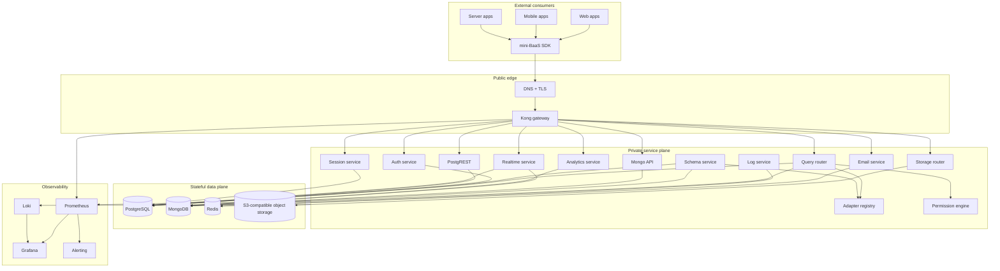

# Production BaaS Architecture

This document defines the production architecture for mini-BaaS as a reusable, self-hostable Backend-as-a-Service platform.

## Design Goals

- Keep the full microservices architecture.
- Expose only the API gateway publicly.
- Keep all implementation services private.
- Deploy each major service independently.
- Make the platform reusable by external projects through HTTP APIs and SDKs.
- Avoid Git submodules and code copying for consumers.

## Target Architecture



## Public Boundary

Only the gateway is public.

Public routes are stable product APIs:

| Route           | Owner                          |
| --------------- | ------------------------------ |
| `/auth/v1`      | Auth service                   |
| `/rest/v1`      | PostgREST                      |
| `/mongo/v1`     | Mongo API                      |
| `/query/v1`     | Query router                   |
| `/storage/v1`   | Storage router                 |
| `/realtime/v1`  | Realtime service               |
| `/analytics/v1` | Analytics service              |
| `/email/v1`     | Email service                  |
| `/sessions/v1`  | Session service                |
| `/logs/v1`      | Log service                    |
| `/admin/v1`     | Adapter registry / admin plane |

External consumers must not access internal services directly.

## Private Service Plane

Services communicate over private networking using service DNS names.

On Fly.io the default production pattern is:

```text
https://api.example.com -> mini-baas-gateway
mini-baas-gateway -> mini-baas-auth.internal
mini-baas-gateway -> mini-baas-query-router.internal
mini-baas-query-router -> mini-baas-adapter-registry.internal
```

Every service must propagate:

- `X-Request-ID`
- authenticated user claims injected by the gateway
- service tokens for machine-to-machine calls

## Authentication Model

External clients use:

```text
apikey: public anon key
Authorization: Bearer user JWT
```

Server-side consumers may use a service-role key. Service-role keys must never be shipped to browsers or mobile apps.

The gateway validates API keys and JWTs, then injects trusted identity headers for internal services.

## Reusability Model

External projects consume mini-BaaS through:

1. Stable HTTP APIs.
2. Long-term SDK packages:
   - `@mini-baas/js`
   - `@mini-baas/react`
   - `@mini-baas/node`

No external project should import internal service source code or mount this repository as a submodule.

## Failure Isolation

Each major service is independently deployed, scaled, restarted, and rolled back.

Failure boundaries:

- Analytics failure must not break auth.
- Email failure must not break query execution.
- Storage failure must not break sessions.
- Realtime failure must not break REST APIs.

Gateway and clients should receive structured errors with request IDs.

## Production Requirements

Minimum production controls:

- gateway-only ingress
- per-service Fly secrets
- managed Postgres for auth/core relational state
- managed MongoDB for document stores
- managed Redis or equivalent queue/cache layer
- S3-compatible object storage
- JSON logs
- metrics per service
- distributed tracing via OpenTelemetry
- uptime and latency alerts
- query timeouts and request size limits
- rate limits at the gateway
- per-service health checks
