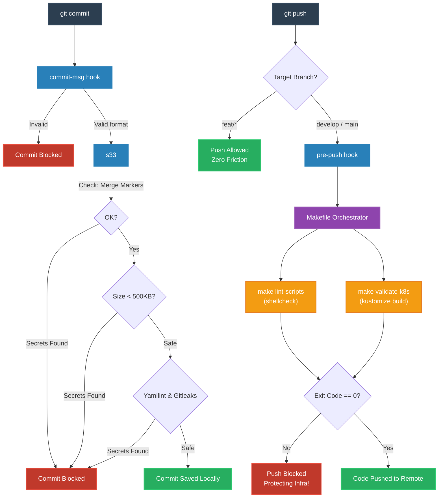

# QA & CI/CD Implementation Summary — Session 1

**Date:** March 19, 2026  
**Repository:** `mini-baas-infra`  
**Objective:** Port the "Git Hooks & Quality Shield" architecture from the `transcendence` project and adapt it specifically for Infrastructure-as-Code (IaC), eliminating all Node.js dependencies.

---

## 1. Executive Overview

This session successfully established a **Zero-Dependency, Native Git Hooks-based QA system** for the `mini-baas-infra` repository. Because this repository manages Kubernetes infrastructure, we replaced web-development tools (ESLint, Prettier) with infrastructure-specific validators (`yamllint`, `shellcheck`, `kustomize`).

We implemented a **Progressive Validation Strategy**:
1. **Local Commits:** Fast syntax and security checks (Secrets, YAML).
2. **Feature Branch Pushes:** Allowed freely (Zero Friction).
3. **Protected Branch Pushes:** Deep architectural validation (Kustomize builds, Shellcheck).

---

## 2. Architecture & Workflow

The following diagram illustrates the lifecycle of a developer's code from typing `git commit` to pushing to a shared branch.



---

## 3. Implementation Phases

### ✅ PHASE 1: The Native Foundation
**Goal:** Establish the baseline without relying on Husky or Node.js.

* **`scripts/hooks/log_hook.sh`**: The styling engine. Provides standardized, colored output across all scripts (`log_info`, `log_success`, `log_error`).
* **`scripts/hooks/commit-msg`**: Enforces the **Conventional Commits** standard using pure Bash Regex. 
  * *Allowed format:* `type(scope): description`
  * *Allowed types:* `feat`, `fix`, `docs`, `chore`, `test`, `refactor`, `perf`, `ci`, `revert`, `style`.
  * *Example of allowed commit:* `feat(api-gateway): add new deployment overlay`
  * *Example of blocked commit:* `add new feature` (Blocks with exit code 1).
* **`Makefile` Orchestration**: Created the `install-hooks` target.
  ```bash
  make install-hooks
  # Executes: git config --local core.hooksPath scripts/hooks
  ```

### ✅ PHASE 2: The Infra Pre-Commit Guard
**Goal:** Prevent malformed configurations and leaked secrets from entering the Git history.

* **File:** `scripts/hooks/pre-commit`
* **Checks Executed:**
  1. **Merge Conflicts:** Blocks commits if `<<<<<<<` or `=======` are left in the code.
  2. **File Size:** Warns and blocks if any staged file exceeds 500KB.
  3. **YAML Syntax:** Runs `yamllint` on staged `.yaml`/`.yml` files.
  4. **Secret Detection:** Runs `gitleaks detect --protect --staged` to catch AWS keys, JWT tokens, etc., before they are saved.
* **Graceful Degradation:** If `yamllint` or `gitleaks` are not installed on the developer's machine, the script shows a warning but allows the commit to proceed, preventing workflow paralysis.

### ✅ PHASE 3: The Infra Pre-Push Guard
**Goal:** Ensure Kubernetes manifests render correctly before affecting shared environments.

* **File:** `scripts/hooks/pre-push`
* **Adaptive Logic:** * If the branch is `feat/new-schema`, the script exits immediately (push allowed).
  * If the branch is `main` or `develop`, it delegates deep validation to the `Makefile`.
* **Deep Validations (Triggered via Makefile):**
  1. **`make lint-scripts`**: Runs `shellcheck` against the `scripts/` directory to prevent bad Bash practices.
  2. **`make validate-k8s`**: Runs `kustomize build` against the `deployments/overlays/*` directories. This is the equivalent of compiling code: if a YAML indentation is wrong, Kustomize fails, and the push is blocked.

### ✅ PHASE 4: The Universal Makefile Orchestrator
**Goal:** Centralize the execution of QA tasks so developers don't have to remember complex CLI arguments.

```makefile
# Make Targets Available to Developers:

make lint-yaml     # Runs yamllint on deployments/ and platform/
make lint-scripts  # Runs shellcheck on scripts/
make validate-k8s  # Runs kustomize build to catch rendering errors
make qa-all        # Runs all the above sequentially
make install-hooks # Activates the DevOps shield locally
```

---

## 4. File Structure Deployed

```text
mini-baas-infra/
├── Makefile                          # Main orchestrator (Phases 1 & 4)
├── scripts/
│   └── hooks/
│       ├── log_hook.sh               # Styling and logging utility
│       ├── commit-msg                # Regex format validation
│       ├── pre-commit                # Syntax & secrets guard
│       └── pre-push                  # K8s & shellcheck guard
```

---

## 5. Usage & Developer Experience (DX)

### Installation for New Developers
When a new developer clones the repository, they only need to run:
```bash
make install-hooks
```
*Output: `✅ Git hooks installed successfully. core.hooksPath points to scripts/hooks`*

### Example: The Shield in Action
A developer tries to push malformed YAML to the main branch:
```bash
$ git checkout main
$ git commit -m "chore(infra): update base manifests"
$ git push origin main

ℹ️  INFO: Current branch: main
⚠️  WARN: Branch 'main' is protected. Running full validation suite...
ℹ️  INFO: Running shellcheck validation...
✅ SUCCESS: Shell script linting passed
ℹ️  INFO: Running Kubernetes manifest validation...
❌ ERROR: Kustomize build failed on deployments/overlays/production
❌ ERROR: Push blocked to protect infrastructure!
```

---

## 6. Next Steps (Session 2)

With the local shield actively protecting the repository, our next goals are:

1. **Cloud CI Integration:** Translate the `make qa-all` target into a GitHub Actions `.yml` workflow to serve as the ultimate judge for Pull Requests.
2. **Hook Bypass Policies:** Define team rules for when it is acceptable to use `git commit --no-verify`.
3. **Kubeconform:** Integrate `kubeconform` into the `validate-k8s` target to ensure our rendered YAMLs strictly match the official Kubernetes API specifications.