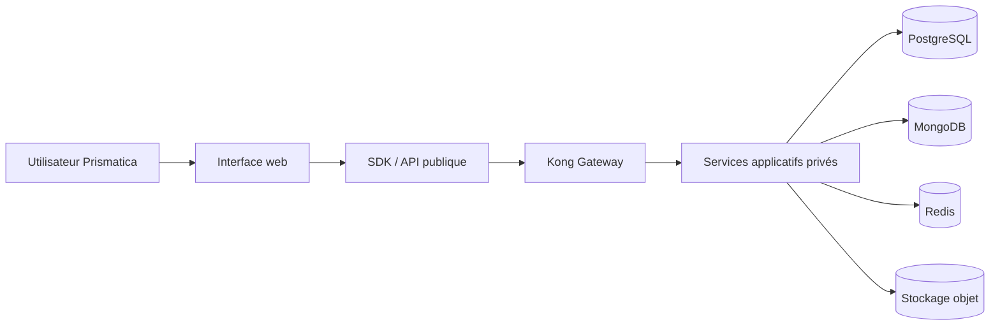
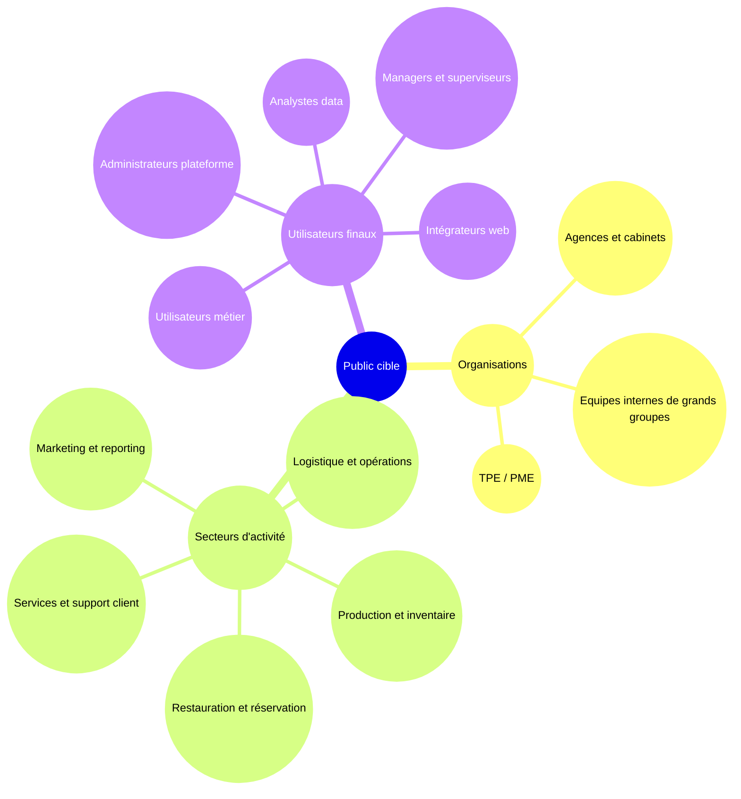
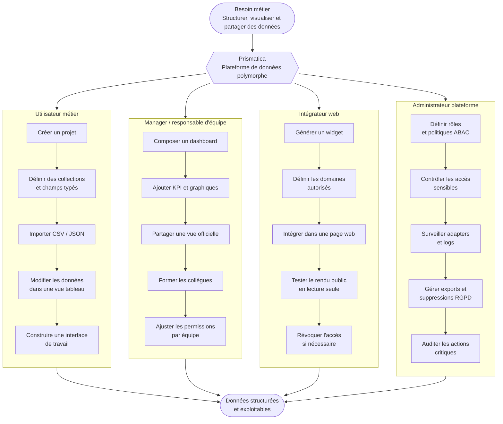
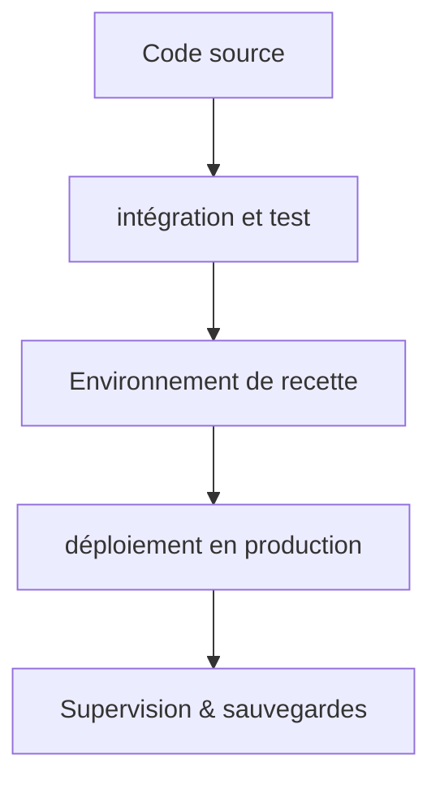

# DOSSIER DE PROJET

## Développeur web et web mobile

## LESIEUR DYLAN

## TABLE DES MATIÈRES

1. [DOSSIER DE PROJET](#dossier-de-projet)
2. [TABLE DES MATIÈRES](#table-des-matières)
3. [CHAPITRE 1. Synthèse des compétences mobilisées]
4. [CHAPITRE 2. Présentation du projet]
5. [CHAPITRE 3. Les réalisations personnelles, front-end (React / SCSS)]
6. [CHAPITRE 4. Les réalisations personnelles, back-end (Node.js / Express / MongoDB / POSTGRESQL)]
7. [CHAPITRE 5. Eléments de sécurité de l'application]
8. [CHAPITRE 6. Jeu d'essai]
9. [CHAPITRE 8. Conclusion]
10. [Annexes]

## CHAPITRE 1. Synthèse des compétences mobilisées

La réalisation du projet **Prismatica**, une application de gestion de bases de données et de création de dashboards pour les entreprises, a mobilisé un large éventail de compétences techniques et méthodologiques. Mon intervention a porté sur la conception d'une solution robuste, sécurisée et optimisée pour un usage professionnel principalement desktop.

Mon travail s'est réparti entre la conception d'interfaces utilisateur, la mise en place de l'infrastructure de données, la définition des règles de sécurité et la construction d'une logique back-end générique capable de soutenir plusieurs cas d'usage métier.

> Activité type n°1 : Développer la partie front-end d'une application web ou web mobile sécurisée.

**Conception des interfaces utilisateur (maquetter)** : j'ai initié le projet par la création de maquettes et de parcours utilisateurs. Ces supports ont permis de définir l'expérience utilisateur, la hiérarchie des écrans et les interactions principales : création de collections, configuration de vues, composition de dashboards et gestion des permissions. Dans le contexte de Prismatica, une approche **desktop first** a été privilégiée, car l'application manipule des tableaux, graphiques, formulaires complexes et interfaces de configuration qui sont plus adaptés à un écran large. Le responsive design reste néanmoins prévu afin de permettre la consultation et certains usages simples sur tablette ou mobile.

**Intégration des interfaces statiques (réaliser)** : j'ai structuré l'application avec du HTML sémantique et du SCSS afin d'obtenir une base lisible, maintenable et cohérente. Les composants ont été pensés pour être réutilisables : cartes, tableaux, formulaires, panneaux latéraux, modales et widgets de dashboard.

**Développement de l'interactivité (développer la partie dynamique)** : j'ai utilisé **React** pour rendre l'interface dynamique. Mon rôle a consisté à gérer les appels asynchrones vers l'API, les états de chargement, les formulaires réactifs, les retours d'erreur, les mises à jour conditionnelles de l'interface et la préparation des interactions nécessaires au builder de données et de dashboards.

> Activité type n°2 : Développer la partie back-end d'une application web ou web mobile sécurisée.

BaaS signifie **Backend as a Service**. Il s'agit d'une infrastructure back-end préconfigurée qui fournit des briques communes : authentification, stockage, API, permissions, temps réel, fichiers, emails et observabilité. Dans Prismatica, cette approche permet de concentrer l'effort produit sur la gestion des données et l'expérience utilisateur, tout en s'appuyant sur une plateforme technique réutilisable. J'ai structuré le back-end comme une **usine à backends génériques**, capable de fournir des services standardisés sans recoder une API métier complète pour chaque nouveau projet.

| Membre | Rôle principal | Responsabilités observées / déduites |
| ------ | -------------- | ------------------------------------ |

| dlesieur | Product Owner / Tech Lead / DevOps / Back-End Lead | Conception de l'architecture, intégration Docker, orchestration des services, sécurité, écriture des services NestJS, outillage d'exploitation, documentation technique |

**Modélisation de la base de données** J'ai conçu le schéma de la base de données relationnelle **PostgreSQL** pour stocker les données de l'application, en veillant à la normalisation et à l'optimisation des requêtes. J'ai également utilisé **MongoDB** pour certaines fonctionnalités nécessitant une flexibilité accrue dans la gestion des données. La modélisation a permis de structurer les données de manière efficace, facilitant ainsi les opérations de lecture et d'écriture en définissant des relations claires entre les différentes entités de l'application et les contraintes d'intégrité.

**Élaboration des composants d'accès aux données** : j'ai développé des composants permettant d'interagir avec les bases de données à travers des services contrôlés. La gateway `Kong` centralise les accès publics, tandis que les services internes appliquent les permissions et routent les requêtes vers PostgreSQL, MongoDB ou les adapters nécessaires. Des mécanismes de cache et de supervision ont également été intégrés pour améliorer la performance et la fiabilité. Le moteur `Trino` est réservé aux usages analytiques et aux requêtes fédérées, afin de ne pas alourdir le chemin critique des opérations CRUD.

## CHAPITRE 2. Présentation du projet

### Présentation de l'entreprise

Le projet **Prismatica** s'inscrit dans le contexte de **NovaSphere**, une société de conseil composée de développeurs et de designers qui accompagne des clients aux besoins métiers variés : logistique, marketing, restauration, services, opérations internes ou suivi commercial. Ces organisations partagent une difficulté commune : leurs données sont dispersées entre des tableurs, des outils propriétaires, des applications vieillissantes ou des bases de données sans interface réellement exploitable par les équipes métier.

NovaSphere construisait jusqu'ici des tableaux de bord et des interfaces spécifiques pour chaque client. Cette approche devenait coûteuse, difficile à maintenir et peu scalable. L'objectif de Prismatica est donc de créer une plateforme générique permettant de transformer des données brutes en espaces de travail visuels, dashboards, vues métiers et interfaces web réutilisables.

Dans ce projet, mon rôle a été de concevoir une solution capable de répondre à deux enjeux complémentaires :

- offrir une interface de gestion de données compréhensible par des utilisateurs non développeurs ;
- fournir une infrastructure back-end robuste, sécurisée et réutilisable, capable de supporter des données relationnelles, documentaires, temps réel et des règles d'accès avancées.

Prismatica n'est donc pas seulement un outil de visualisation. C'est une application de **database management orientée métier** : elle permet de créer des collections, de structurer des champs, de visualiser les informations sous plusieurs formes, de composer des dashboards et de publier certaines vues dans une page web ou dans un espace applicatif autonome.

L'infrastructure mini-BaaS développée autour du projet apporte la couche technique nécessaire : authentification, API gateway, base relationnelle, base documentaire, permissions, routage des requêtes, stockage, observabilité et déploiement Dockerisé.

### Cahier des charges du projet

#### contexte et objectifs

Le projet **Prismatica** vise à développer une application web permettant aux entreprises de créer, organiser, visualiser et exploiter leurs données sans dépendre systématiquement d'un développeur pour chaque modification d'interface, de structure ou de tableau de bord.

Le besoin initial vient d'un constat fréquent en entreprise : les équipes métier manipulent quotidiennement des informations importantes, mais ces informations sont souvent stockées dans des outils non reliés entre eux. Les données peuvent être présentes dans des fichiers CSV, des tableurs, des exports logiciels, des bases SQL, des documents ou des applications internes anciennes. Cette fragmentation rend les processus plus lents, complique la collaboration et limite la capacité à produire des dashboards fiables.

Prismatica répond à ce problème avec une interface web visuelle et user-friendly. L'utilisateur peut créer un projet, définir ses collections comme dans une base de données, ajouter des champs typés, importer des données, construire des vues, composer des dashboards et publier certaines interfaces sous forme de page autonome ou de composant intégré dans un site existant.

Le positionnement est volontairement hybride :

- une couche **database management** pour structurer les données ;
- une couche **CMS métier** pour créer des interfaces adaptées à un usage opérationnel ;
- une couche **dashboarding** pour visualiser les indicateurs ;
- une couche **adapter/embed** pour exposer une vue, un formulaire, un endpoint ou un widget à l'extérieur ;
- une couche **permissions** pour contrôler précisément qui peut voir, modifier, publier ou administrer chaque ressource.

L'enjeu principal est l'autonomie. Un manager, un responsable métier ou un collaborateur formé doit pouvoir faire évoluer son espace de travail, ajouter un tableau, modifier une vue, filtrer des données ou publier un dashboard sans attendre une intervention technique lourde. Les développeurs restent nécessaires pour l'infrastructure, les intégrations complexes et la sécurité, mais les ajustements métier courants deviennent accessibles aux utilisateurs autorisés.

Les objectifs du projet sont donc les suivants :

- centraliser les données d'un projet ou d'une équipe dans un espace sécurisé ;
- permettre la création de schémas de données visuels et compréhensibles ;
- proposer plusieurs représentations d'une même donnée : tableau, graphique, KPI, calendrier, kanban ou carte ;
- créer rapidement des dashboards utilisables en interne, en démonstration client ou intégrés dans une page web ;
- rendre les utilisateurs métier plus autonomes dans l'organisation de leurs données ;
- garantir la traçabilité, la sécurité et la séparation des accès ;
- fournir une base technique réutilisable pour d'autres applications métiers.

#### objectifs du projet et choix architecturaux

Le projet poursuit un objectif produit et un objectif technique.

Sur le plan produit, Prismatica doit permettre de créer des applications de données rapidement : un utilisateur définit un modèle, crée des vues, assemble une interface, partage un dashboard et forme ses collègues à l'utiliser. La même donnée peut servir plusieurs usages sans duplication : suivi interne, reporting direction, widget public, formulaire, export ou API.

Sur le plan technique, le back-end ne devait pas être limité à un seul métier ou à un seul modèle de données. Il devait rester générique, sécurisé et extensible. C'est pourquoi l'architecture a été pensée comme une plateforme **BaaS** auto-hébergée, orientée Docker Compose, capable de fournir des briques réutilisables : authentification, données relationnelles, données documentaires, requêtage multi-tenant, temps réel, stockage objet, email transactionnel, logs, métriques et politiques de sécurité unifiées.

Les principes retenus sont les suivants :

- le SDK et l'interface front-end expriment une intention utilisateur ;
- la gateway sécurise l'entrée publique et applique les contrôles transverses ;
- le back-end reste l'autorité pour les permissions et l'exécution des requêtes ;
- le `query-router` orchestre les accès SQL/NoSQL sans exposer directement les bases ;
- le `permission-engine` applique les règles RBAC/ABAC côté serveur ;
- l'`adapter-registry` conserve les métadonnées nécessaires aux connexions et aux mappings ;
- PostgreSQL porte les données relationnelles et les contrôles forts ;
- MongoDB peut porter les données documentaires ou analytiques ;
- Trino est réservé aux usages analytiques et fédérés, pas au CRUD transactionnel ;
- Docker Compose permet de lancer les plans de service selon leur criticité.

Ce découpage évite que la logique de sécurité soit placée côté client. Il permet aussi de rendre la plateforme réutilisable : Prismatica devient une application construite sur mini-BaaS, mais mini-BaaS peut également servir de base à d'autres produits métiers.

#### Architectures logicielles et choix techniques

L'architecture applicative repose sur une séparation claire entre l'expérience utilisateur, l'API publique, les services privés et les plans de données. Cette organisation permet de garder une interface simple côté utilisateur tout en conservant une plateforme robuste côté infrastructure.

Le parcours général est le suivant :

Les choix techniques principaux sont :

- **React / SCSS** pour construire une interface dynamique, responsive et adaptée aux usages desktop complexes ;
- **Node.js / TypeScript / NestJS** pour développer des services back-end modulaires ;
- **Kong Gateway** pour centraliser les routes publiques, l'authentification, le rate limiting et les contrôles transverses ;
- **PostgreSQL** pour les données relationnelles, les règles fortes, les schémas et les contrôles d'intégrité ;
- **MongoDB** pour certains usages documentaires, analytiques ou flexibles ;
- **Redis** pour le cache, les files ou les usages temps réel légers ;
- **MinIO** pour le stockage objet compatible S3 ;
- **Prometheus, Grafana, Loki et Promtail** pour l'observabilité ;
- **Docker Compose** pour orchestrer l'ensemble des services de manière reproductible.

La pile est divisée en plans de criticité. Le cœur BaaS contient les services indispensables : gateway, authentification, PostgreSQL, PostgREST, Realtime et Redis. Les plans adapter, control, data, analytics, background et observability peuvent être activés selon les besoins. Cette séparation évite de rendre toute l'application dépendante de services secondaires.

#### outillage de développement et de déploiement

L'environnement de développement a été conçu pour être reproductible. La dépendance locale attendue est **Docker**. Les dépendances Node.js sont installées avec **pnpm** à l'intérieur des conteneurs afin d'éviter les écarts entre machines de développement.

Les outils principaux sont :

- **Git / GitHub** pour le versionnement et la traçabilité des commits ;
- **Docker Compose** pour le lancement local des services ;
- **Makefile** pour standardiser les commandes de validation, build, test et démarrage ;
- **pnpm** comme gestionnaire de paquets dans Docker ;
- **ESLint / Prettier** pour la qualité et l'homogénéité du code ;
- **SonarQube / SonarCloud** pour l'analyse de qualité et de sécurité ;
- **scripts shell** pour les smoke tests, la validation des secrets et les tests de phases ;
- **documentation Markdown** pour conserver les décisions techniques et fonctionnelles.

Cette approche permet à un membre de l'équipe de récupérer le projet, lancer les conteneurs et exécuter les vérifications sans dépendre d'une installation locale spécifique de Node.js ou npm.

#### stratégie de sécurisation

La stratégie de sécurité repose sur un principe : le client ne décide jamais seul de ses droits. L'interface et le SDK expriment une demande, mais les décisions de permission sont prises côté serveur.

Les mesures principales sont :

- authentification par JWT et sessions renouvelables ;
- gateway publique unique, les microservices restant privés ;
- validation des entrées côté API ;
- rate limiting sur les routes sensibles ;
- séparation des données par utilisateur, projet ou tenant ;
- contrôle d'accès RBAC et ABAC ;
- journalisation des actions sensibles ;
- stockage des secrets hors du code source ;
- chiffrement ou hachage des informations sensibles ;
- accès publics limités à la lecture seule ;
- révocation possible des liens publics et clés d'adapters ;
- prise en compte des exigences RGPD : export, suppression, portabilité et minimisation des données.

L'ABAC est particulièrement important pour Prismatica, car l'application doit permettre des règles fines : un utilisateur peut avoir le droit de modifier une ressource dans un projet, mais seulement si elle appartient à son équipe, si elle n'est pas publiée, ou si son rôle contient un attribut spécifique. Cette logique reste côté back-end pour éviter toute falsification depuis le navigateur.

### Public cible et profils utilisateurs

#### définition du public cible

L'application **Prismatica** s'adresse aux organisations qui ont besoin de transformer des données dispersées en interfaces exploitables, sans engager un développement spécifique à chaque changement métier. Le public cible principal est constitué d'équipes professionnelles qui utilisent déjà des données au quotidien mais qui manquent d'un outil unifié pour les structurer, les visualiser, les partager et les maintenir.

Les entreprises concernées peuvent être des TPE, PME, associations, équipes internes de grands groupes ou agences qui accompagnent plusieurs clients. Les secteurs les plus pertinents sont ceux où les données évoluent régulièrement et doivent être comprises rapidement : logistique, opérations terrain, marketing, restauration, gestion commerciale, ressources humaines, suivi de production, support client, gestion de projets, inventaire ou reporting.

La cible principale n'est pas uniquement le développeur. Prismatica vise surtout les **utilisateurs métier** : responsables d'équipe, coordinateurs, analystes, administrateurs fonctionnels, collaborateurs opérationnels et décideurs. Ces profils connaissent leurs données et leurs processus, mais n'ont pas toujours les compétences ou le temps pour écrire du SQL, développer une API ou maintenir une interface sur mesure.

Prismatica leur donne une autonomie encadrée : ils peuvent créer des espaces de données, composer des dashboards, modifier des vues et former leurs collègues, tout en restant dans un cadre sécurisé par les permissions, la traçabilité et les règles ABAC.

Les besoins principaux du public cible sont :

- remplacer des tableurs isolés par une base structurée ;
- créer rapidement une interface de consultation et de modification des données ;
- visualiser les indicateurs importants sans outil de BI complexe ;
- publier un dashboard officiel pour une équipe ou un client ;
- intégrer une vue ou un widget dans une page web existante ;
- limiter l'accès aux données selon le rôle, l'équipe, le projet, le contexte ou la propriété de la ressource ;
- réduire la dépendance aux développeurs pour les évolutions courantes ;
- conserver une architecture robuste pour les intégrations plus techniques.

#### détails des profils utilisateurs

Les profils utilisateurs de Prismatica sont organisés selon leur niveau d'autonomie, leur responsabilité sur les données et leur périmètre d'accès. Le système de permissions doit permettre de personnaliser ces profils finement grâce à une approche ABAC : l'accès ne dépend pas seulement d'un rôle global, mais aussi d'attributs comme le projet, l'équipe, le propriétaire de la donnée, le type de ressource, l'environnement ou l'action demandée.

| Profil | Objectif principal | Besoins fonctionnels | Droits typiques |
| ------ | ------------------ | -------------------- | --------------- |
| Visiteur non authentifié | Consulter une ressource publique ou contacter l'organisation | Voir un dashboard public, remplir un formulaire, lire une vue intégrée | Lecture publique limitée, aucune modification |
| Utilisateur métier | Gérer ses propres projets de données | Créer des collections, importer des données, créer des vues, composer des dashboards | CRUD sur ses projets, partage contrôlé, gestion de ses adapters |
| Collaborateur opérationnel | Utiliser l'interface au quotidien | Consulter les données utiles, mettre à jour des statuts, filtrer, commenter ou compléter des lignes | Lecture/écriture limitée selon le projet, l'équipe ou les lignes autorisées |
| Manager ou responsable d'équipe | Piloter une activité et former les collègues | Créer des dashboards, suivre des KPI, organiser les vues, partager les espaces de travail | Gestion des vues et dashboards d'équipe, invitation et formation des utilisateurs |
| Analyste / data-oriented user | Exploiter les données pour produire des indicateurs | Construire des graphiques, agrégations, exports, comparaisons, rapports | Lecture étendue, création de vues analytiques, exports contrôlés |
| Intégrateur / webmaster / product owner | Relier Prismatica à un site ou une application | Générer un embed, configurer un endpoint, intégrer un formulaire ou un widget | Gestion des adapters, restrictions de domaines, clés API limitées |
| Employé support plateforme | Accompagner les utilisateurs et surveiller la plateforme | Consulter l'état des projets, diagnostiquer les adapters, modérer un dashboard public | Lecture transverse encadrée, actions de support tracées |
| Administrateur plateforme | Garantir la sécurité et la gouvernance globale | Gérer les comptes, rôles, politiques, limites, configuration et conformité | Administration complète, actions sensibles auditées |

Cette répartition permet d'adapter Prismatica à plusieurs contextes. Une petite entreprise peut utiliser seulement quelques profils simples, tandis qu'une organisation plus structurée peut définir des règles avancées : par exemple, un manager peut modifier les dashboards de son équipe mais pas ceux d'un autre service ; un collaborateur peut modifier uniquement les lignes dont il est responsable ; un client externe peut consulter un dashboard public sans accéder aux données sources.

#### Scénarios d'utilisation

Les scénarios suivants illustrent l'usage attendu de Prismatica dans un contexte professionnel. Ils montrent que l'application peut servir à la fois d'outil interne de gestion, d'interface de dashboarding et de couche de publication vers l'extérieur.

Exemples concrets d'utilisation :

- une équipe marketing crée un dashboard officiel de suivi de campagne et l'intègre dans son intranet ;
- un restaurant publie un calendrier de disponibilité en lecture seule sur son site ;
- une équipe logistique suit ses interventions dans une vue kanban et un tableau de bord de performance ;
- un responsable commercial importe un fichier client, crée des indicateurs et partage une vue filtrée à son équipe ;
- un administrateur définit des règles ABAC pour que chaque collaborateur voie uniquement les données de son périmètre.

### Fonctionnalités attendues

#### clients

Les utilisateurs authentifiés doivent pouvoir :

- créer et gérer des projets ;
- créer des collections représentant des tables ou ensembles de données ;
- définir des champs typés : texte, nombre, date, booléen, sélection, relation, fichier ou champ calculé ;
- importer et exporter des données au format CSV ou JSON ;
- créer des vues polymorphes : tableau, graphique, KPI, calendrier, kanban ;
- composer des dashboards par glisser-déposer ;
- partager un dashboard en lecture seule ;
- intégrer une vue dans une page web via un widget sécurisé ;
- configurer des adapters d'entrée ou de sortie ;
- gérer leurs sessions et demander l'export ou la suppression de leurs données.

#### administrateurs

Les administrateurs doivent pouvoir :

- gérer les comptes utilisateurs et employés ;
- définir les rôles, groupes, attributs et politiques d'accès ;
- configurer les règles ABAC selon le projet, l'équipe, la ressource ou l'action ;
- consulter les métriques d'usage de la plateforme ;
- superviser les adapters, endpoints publics, webhooks et erreurs ;
- désactiver ou révoquer un accès public ;
- gérer les paramètres globaux : limites, formats autorisés, modèles d'email ;
- réaliser les actions RGPD : export, suppression, anonymisation ou audit.

#### users non authentifiés

Les visiteurs non authentifiés peuvent :

- consulter un dashboard public en lecture seule ;
- visualiser un widget intégré dans un site externe ;
- remplir un formulaire public généré depuis une collection ;
- utiliser la page de contact ;
- accéder uniquement aux ressources explicitement publiées.

Aucune modification de schéma, de donnée ou de permission ne doit être possible depuis un accès public.

#### MVP

Le MVP se concentre sur les fonctionnalités qui démontrent la valeur principale de Prismatica : transformer rapidement une donnée en interface exploitable.

Périmètre MVP :

- authentification et gestion de session ;
- création d'un projet ;
- création de collections et de champs ;
- import simple de données ;
- vue tableau filtrable et éditable ;
- au moins deux vues de visualisation : graphique et KPI ;
- création d'un dashboard ;
- partage en lecture seule ;
- permissions de base complétées par une structure compatible ABAC ;
- traçabilité des actions sensibles ;
- documentation d'installation Docker et pnpm.

#### perspective d'évolution

Les évolutions prévues concernent l'industrialisation de la plateforme et l'enrichissement de l'expérience utilisateur :

- éditeur de schéma visuel avec diagramme relationnel ;
- vues avancées : calendrier, kanban, carte, graphiques multi-séries ;
- génération d'endpoints REST contrôlés ;
- webhooks et imports planifiés ;
- bibliothèque de templates métiers ;
- système complet d'embed avec thème, langue et restrictions de domaines ;
- analytics avancées via plan de données dédié ;
- collaboration temps réel ;
- versioning des schémas et rollback ;
- marketplace d'adapters ;
- assistant de configuration pour guider les utilisateurs non techniques.

### Contraintes et risques

Le projet présente plusieurs contraintes liées à son ambition fonctionnelle et technique.

| Contrainte / risque | Impact possible | Réponse prévue |
| ------------------- | --------------- | -------------- |
| Largeur fonctionnelle du produit | Risque de dispersion et de MVP trop vaste | Priorisation autour du triptyque collections, vues, dashboards |
| Données dynamiques créées par les utilisateurs | Complexité de modélisation et de validation | Schéma contrôlé, types limités, migrations encadrées |
| Permissions personnalisables | Risque de faille d'accès si la logique est côté client | Permissions serveur, ABAC, audit et tests d'accès |
| Dashboards publics et embeds | Risque d'exposition involontaire de données | Lecture seule, tokens opaques, révocation, restrictions de domaines |
| Volumétrie des données | Risque de lenteur sur les vues et graphiques | Pagination, agrégations serveur, cache et limites par plan |
| Multiplication des services Docker | Complexité de maintenance | Profils Compose par criticité et documentation d'exploitation |
| Hétérogénéité SQL/NoSQL | Risque d'abstraction trop générale | Adapters spécialisés et vocabulaire API normalisé côté produit |
| Conformité RGPD | Risque juridique et fonctionnel | Export, suppression, traçabilité et minimisation des données |

La principale limite du projet concerne le temps disponible. Prismatica couvre un périmètre vaste : base de données visuelle, interface de type CMS métier, dashboards, adapters, embeds, permissions et infrastructure BaaS. Le MVP doit donc rester concentré sur les fonctionnalités qui prouvent la valeur du produit sans chercher à finaliser toutes les évolutions avancées.

### les livrables

Les livrables attendus pour le projet sont les suivants :

- dépôt GitHub contenant le code source, l'infrastructure et la documentation ;
- documentation d'installation et de lancement avec Docker Compose ;
- dossier projet décrivant le contexte, le besoin, la cible, l'architecture et les choix techniques ;
- documentation back-end de la plateforme mini-BaaS ;
- scripts de validation et de smoke tests ;
- configuration des services principaux : gateway, base de données, authentification, API, observabilité ;
- maquettes ou captures des interfaces principales ;
- jeu de données de test ou scripts de seed ;
- description des profils utilisateurs et des scénarios d'utilisation ;
- éléments de sécurité : authentification, permissions, séparation des accès, gestion des secrets ;
- procédure de déploiement ou d'exécution locale reproductible.

Ces livrables doivent permettre à un évaluateur, un développeur ou un membre d'équipe de comprendre le produit, de lancer l'environnement, de vérifier les choix techniques et d'identifier clairement les fonctionnalités réalisées ou prévues.

### Environnement humain et technique

#### Environnements humain et méthodologie

j'ai travaillé au sein d'une équipe de développement fonctionnant sous la méthodologie **Agile (Scrumban)**. Ce cadre a permis des cycles de développement itératifs et une collaboration étroite entre les membres de l'équipe, favorisant ainsi une adaptation rapide aux changements et une livraison continue de valeur. Nous avons utilisé des outils de gestion de projet tels que **Jira** pour suivre les tâches, les sprints et les progrès du projet, assurant une transparence totale et une communication efficace au sein de l'équipe.

les différents rôles au sein de l'équipe comprenaient un Product Owner, un Tech Lead, des développeurs front-end et back-end, ainsi que des spécialistes en sécurité. Chaque membre de l'équipe avait des responsabilités spécifiques, contribuant à la réussite globale du projet.

| Membre   | Rôle                                                    | spécialité             | Responsabilités observées / déduites                                                                                                                                    |
| :------- | ------------------------------------------------------- | ---------------------- | ----------------------------------------------------------------------------------------------------------------------------------------------------------------------- |
| dlesieur | Product Owner / Tech Lead / Product manager / developer | project chef           | Conception de l'architecture, intégration Docker, orchestration des services, sécurité, écriture des services NestJS, outillage d'exploitation, documentation technique |
| daniel   | Product Owner / Developeur                              | assistant project chef | Conception et développement des interfaces utilisateur, intégration avec le back-end, optimisation de l'expérience utilisateur                                          |
| sergio   | Tech Lead / Développeur                                 | frontend               | Conception et développement de l'API, gestion de la base de données, implémentation de la logique métier, sécurité du back-end                                          |
| roxanne  | Tech Lead                                               | security               | Analyse des risques de sécurité, mise en place de mesures de protection, audits de sécurité, conformité RGPD                                                            |
| vadim    | Product Manager / Developer                             | scrum manager          | Analyse des risques de sécurité, mise en place de mesures de protection, audits de sécurité, conformité RGPD                                                            |

J'étais donc au centre du processus, responsable de la chaîne complète de développement, de la donnée(BDD) à l'interface (front-end). L'organization de mon équipe tourné autour des principes de scrum, avec des réunions quotidiennes pour synchroniser les progrès, des revues de sprint pour évaluer les livrables et des rétrospectives pour identifier les axes d'amélioration. Cette approche a permis une collaboration efficace et une adaptation rapide aux changements de priorités ou de besoins du projet.

##### Rituels

Scrumban combine les éléments de Scrum et de Kanban pour offrir une flexibilité maximale dans la gestion des projets. Nous avons d'une part
scrum avec lequel des rituels mis en place pour assurer une collaboration efficace et une livraison continue de valeur:

- **Daily Stand-up**: une réunion quotidienne de 15 minutes pour synchroniser les progrès, identifier les obstacles et planifier les tâches pour la journée.
- **Sprint Planning**: une réunion au début de chaque sprint pour planifier les tâches à
- **DoD** (Definition of Done): une liste de critères que chaque tâche doit remplir pour être considérée comme terminée, assurant ainsi la qualité et la cohérence des livrables.
- **Sprint Review**: une réunion à la fin de chaque sprint pour présenter les livrables aux parties prenantes, recueillir des feedbacks et ajuster les priorités pour les prochains sprints.
- **Sprint Retrospective**: une réunion pour réfléchir sur le sprint écoulé, identifier ce qui a bien fonctionné, ce qui peut être amélioré et définir des actions concrètes pour améliorer les processus de travail.

mais aussi kanban avec lequel nous avons mis en place un tableau de tâches visuel pour suivre l'avancement du projet, avec des colonnes représentant les différentes étapes du processus de développement (To Do, In Progress, Done). Cela a permis une gestion flexible des tâches et une adaptation rapide aux changements de priorités.

> Contraintes:
> comme le projet avait une portée relativement large, il était essentiel de maintenir une communication claire et efficace au sein de l'équipe pour éviter les > malentendus et assurer une coordination fluide. De plus, la gestion du temps était un défi constant, nécessitant une planification rigoureuse et une capacité à s'adapter rapidement aux changements de priorités ou de besoins du projet. À cet effet, nous avons mis en place une fois par semaine une réunion pour travailler l'écoute active et autre modalité de communication pour améliorer la collaboration au sein de l'équipe.
> :warning: utiliser kanban pour l'intégralité du projet était une option trop lourde due à la largeur et la complexité du projet, et parce que nous étions habitué de faire des projets en solitaires beaucoup plus petits, nous avons opté pour utiliser le kanban seulement quand le container à créer demandé un très haut niveau de rigueur et de suivi, comme c'était le cas pour la partie développement du front-end avec `osionos` un container qui créer littéralement l'interface applicative de la solution. [pour en savoir plus](#ref-osionos)

##### Post de développement

- système d'exploitation: j'ai opéré sur un environnement Linux (Ubuntu) pour le développement, offrant une compatibilité optimale avec les outils et technologies utilisés dans le projet.
- IDE: Mon environnement de développement principal était **Visual Studio Code**, complété par des extensions pour l'investigation de code, la gestion de Git et le développement en React et Node.js.
- Environnement: les dépendances applicatives sont gérées avec pnpm dans Docker afin d'éviter les écarts entre postes de développement; la dépendance locale attendue est Docker.

##### pile applicative (conforme aux choix architecturaux)

- Front-end: Développé avec la librairie `React`. La stylisation a été assurée par `SCSS` (Sass) pour une meilleur modularité des feuillees de style et pour faciliter le _responsive design_
- Back-end: Construit avec `Node.js` et le framework `vite` pour une configuration rapide et une expérience de développement optimisée. J'ai utilisé `Express` pour la gestion des routes et des middlewares, et `MongoDB` et `PostgreSQL` pour la gestion des données, en fonction des besoins spécifiques de chaque fonctionnalité.
- base de données: j'ai utilisé `MongoDB` pour stocker les utilisateurs, les clients et les interventions. Les interactions se font via l'ORM `mongoose` qui garantit une gestion efficace des données et une intégration fluide avec le back-end.

##### gestion du code et contrôle de qualité

- J'ai utilisé l'outil Git avec un dépôt hébergé sur GitHub, ce qui a permis d'assurer un suivi précis de toutes les modifications apportées au projet.
- Nous avons adopté un workflow standard (gitflow) pour la production, incluant une branch principale `main` pour le code stable en production, incluant une branche de développement (develop) pour l'intégration de nouvelles fonctionnalités (feat/, bugfix/, hotfix/, migrate/, etc.) pour le développement et des branches de release pour la préparation des déploiements en production.
- J'ai systématiquement veillé à la rédaction des commits clairs et descriptifs, en utilisant les `hook` de pré-commit pour assurer la qualité du code avant chaque commit, notamment en exécutant des tests unitaires et en vérifiant le respect des normes de codage. Cela m'a assuré d'accroitre la lisibilité de l'historique des modifications et de faciliter la collaboration avec les autres membres de l'équipe. (cela fonctionne avec un regexp)
- dans tous les containers nous sommes stricts. Nous avons mis en place des règles de linting et de formatage pour garantir la cohérence du code, ainsi que des tests unitaires pour assurer la fiabilité et la maintenabilité du code à long terme. Nous avons également utilisé des outils d'intégration continue pour automatiser les tests et les vérifications de qualité à chaque commit, assurant ainsi une livraison continue de code de haute qualité. Des outils comme `ESLint` pour le linting et `Prettier` pour le formatage ont été intégrés dans notre workflow de développement, garantissant que le code respecte les normes de style et de qualité définies par l'équipe. mais aussi des outils comme `sonarcloud` pour l'analyse de la qualité du code et la détection de vulnérabilités potentielles, assurant ainsi une sécurité renforcée et une maintenabilité à long terme du projet.
- les fonctionnalités cirtique (connexion sécurisée, mise à jour du statut d'intervention validation du rapport) ont été vérifiées par des scénarios de test manuels détaillés, afin de garantir la stabilité fonctionnelle de l'application avant son déploiement en recette.

##### Environnements

Pour garantir la qualité et la progresssion du développement, l'application a été développée et testée dans différents environnements:

- \*_Environnement de développement_: utilisé pour le développement quotidien, avec des outils de débogage et de test intégrés pour faciliter le processus de développement.
- **Environnement de test**:
  - Version intermédiaire déployée sur un serveur de test dédié, utilisant des données anonymisées.
  - Cet environnement a servi à la validation des fonctionnalités avec le Lead Technique et le Client avant tout déploiement en production.
  - C'est le lieu où la revue de Sprint a été effectuée

##### Organisation du travail et rituels de projets

Pour garantir la sécurité des accès et la confidentialité des informations critiques dans chaque environnement, j'ai appliqué la stratégie suivante:

- **Gestion des secrets**: J'ai utilisé des outils de gestion des secrets tels que `Vault` pour stocker et gérer les informations sensibles, assurant ainsi une protection robuste contre les accès non autorisés.
- **Contrôle d'accès**: J'ai mis en place des politiques de contrôle d'accès strictes, en utilisant des rôles et des permissions pour limiter l'accès aux données sensibles uniquement aux utilisateurs autorisés, garantissant ainsi la confidentialité et la sécurité des informations critiques.
- Chaque environnement (développement local, recette, production) possède sa propre version du fichier, adaptée à ses besoins de configuration spécifiques.
- le back-end Node.js accède à ses configurations uniquement via les variables d'environnement, assurant la séparation du code et des secrets.

##### Configuration et gestion des secreets

Protection maximal via `bcrypt` pour le hachage des mots de passe, `JWT` pour la gestion des sessions et des tokens d'authentification, et `Vault` pour la gestion centralisée des secrets, assurant ainsi une sécurité renforcée pour les données sensibles de l'application.

Mise en place d'une traçabilité des actions sensibles (connexions, modifications de statut) pour les besoins d'audit

Conformité aux exigences RGAA (sémantique, constrastes, navigation clavier) pour une utilisation incusive sur les terminaux mobiles.

Optimisation du temps de réponse par la pagination de l'API et l'ajout d'index SQL sur les tables fréquemment consultées, assurant ainsi une expérience utilisateur rapide et fluide même avec de grandes quantités de données.

Validation systématique par des scénarios de recette manuels sur les fonctionnalités clés (front et back-end) pour garantir la stabilité fonctionnelle du système.

##### Outillage et données de test

- Jeu de données: Établissement d'un jeu de d'essai complet et cohérent pour tester les différentes fonctionnalités de l'application, en utilisant des données anonymisées pour garantir la confidentialité et la sécurité des informations sensibles.
- Sécurité et initialisation de l'environnement de test: script SQL versionnés pour l'installation rapide et sécurisée de l'environnement de test.
- Transferabilité: Capacité d'extension des données (formats CSV/JSON) pour faciliter les audits et les migrations entre environnements.

### Objectifs de qualité

## CHAPITRE 3. Les réalisations personnelles, front-end (React / SCSS)

## Maquette de l'application et schémas

### Conception "desktop first with mobile companion" et wireframes

### Charte graphique

### typographie

### schéa d'enchainement des maquettes

### Captures d'écran des interfaces utilisateur

### Extraits de code, interfaces utilisateur statiques (React / SCSS)

#### Organisation minimal du projet front

#### Extrait de code, page de connexion (statique et accessible)

### Extrait de code, partie dynamique(React/typecript)

#### Authentification: le formulaire de connexion dynamique

#### récupération des données: la liste des interventions

#### action métier critique: mise à jour du statut d'intervention

## CHAPITRE 4. Les réalisations personnelles, back-end (Node.js / Express / MongoDB / POSTGRESQL)

### Architecture de l'API et modèle de données

#### a. Architecture de l'API et modèle de données

#### b. Schéma conceptuel de données (ERD)

### Extraits de code, structure et sécurité de l'API

#### Choix techniques (contexte et logique)

#### Extrait: controle d'ownership règle d'habilitation critique

#### Extrait 2: mise à jour du statut et validation métier

### Extrait de codes de composants d'accès aux données (DAO)

#### a. Choix techniques (contexte et logique)

#### b. Extrait: Récupération des missions d'un technicien

#### c.Extrait: mise à jour du statut de mission

#### d. Prépration du déploiement

## CHAPITRE 5. Eléments de sécurité de l'application

### Authentification et gestion des rôles

### Validation des entrées et protection contre les injections

### Protections front-end et API

### Protection contre XSS et CSRF

### Conformité RGPD

## CHAPITRE 6. Jeu d'essai

## CHAPITRE 7. Veille technologique et sécurité

### Source de veille utilisées

### vulnérabilités identifiées dans l'écosystème technologique

### failles potentielles et correctifs appliqués

### conclusion

## CHAPITRE 8. Conclusion

## Annexes
